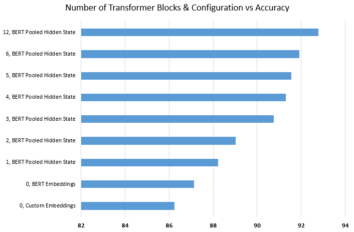
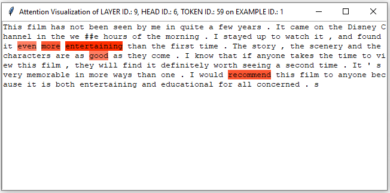

# Comparatively Fine-Tuning BERT

## Introduction
The state-of-the-art pretrained language model BERT (Bidirectional Encoder Representations from Transformers) has achieved remarkable results in many natural language understanding tasks. In general, the industry-wide adoption of transformer architectures (BERT, XLNet, etc.) marked a sharp deviation from the conventional encoder-decoder architectures in sequence-to-sequence tasks such as machine translation. Following this, many parties are increasingly utilizing the pretrained weights of these language representation models, and *fine-tuning* them to suit whatever text-related task they are trying to solve. 

Rooting from the observations above, this repository builds on top of papers like *How to Fine-Tune BERT for Text Classification?* by Chi Sun et al. and *To Tune or Not To Tune? How About the Best of Both Worlds?* by Ran Wang et al., and specifically focuses on minimizing the network depth of a BERT model to an extent where the accuracies for **text classification** tasks are still considerably high, yet the model size isn't as catastrophic as the advertised, full 12-layer architecture.

We hope that this work could help other people reduce their training time, fit their models in modest GPU and storage resources, and help them to further experiment with BERT. One key idea is to realize that sometimes we don't need the full architecture of a state-of-the-art model, but only parts of it, to achieve a sufficiently high performance on some given task. This idea is even more relevant when incorporating the full architecture is costly, and this is definitely the case with BERT and other similar transformer-based models.

Please note that the performance measures and any accompanying findings have been solely formulated on the classic [IMDB](https://ai.stanford.edu/~amaas/data/sentiment/) dataset, and hence within a **binary sentiment classification** framework. We are *planning* to include more datasets in the near future for a more general & qualitative comparison.

## Setting Up
1. Clone this repository: `git clone https://github.com/ongunuzaymacar/comparatively-finetuning-bert.git`
2. Install PyTorch [(installation)](https://pytorch.org/get-started/locally/)
3. Install Pytorch-Transformers: `pip install pytorch_transformers`
4. Download the IMDB dataset: `bash download_imdb_dataset.sh`

## Important Implementation Notes
* For fairness of comparison, we are using the following components:
    - A batch size of **32** is used for models with number of transformer blocks lesser or equal to *4*, a batch size of **16** is used for models with number of transformer blocks *5* or *6*, and finally a batch size of **8** is used for the complete BERT model. This inverse relationship between the batch size hyperparameter and the complexity (hence size) of the model was adapted in order to fit the training processes into GPU. 
    - Adam optimizer that utilizes the same grouped parameters with the same arguments across all *finetuned* & *baseline* model trainings. In particular, we have chosen to fine-tune BERT layers with a lower learning rate of **3e-5**, and a fixed weight decay of **0.01** (for *most* parameters), and to optimize all other custom layers on top with a conventional learning rate of **1e-3** without no decay. As suggested in the paper, such a lower learning rate for BERT parameters is preferred over an aggressive one to overcome the common problem of **catastrophic forgetting** (the forgetting of pretrained knowledge) in transfer learning applications. 
    - GPU choice of **Tesla K80** with a maximum number of **10** epochs.
    - If applicable, a single layer, bidirectional configuration for LSTM layers with a hidden size of **128**.

* All BERT models are pretrained from the `bert-base-cased` model weights. For more information about this and other models, check [here](https://huggingface.co/pytorch-transformers/pretrained_models.html).
* The hidden states extracted from finetuned models, whether directly acquired from the pretrained BERT model or acquired from the additional recurrent (LSTM) layers, undergo a dropout of default rate **0.20**.
* The `pytorch-transformers` implementation of BERT is adapted in this repository to output 4 different tensors: 
  1. **Sequence Output**, `(B, P, H)`: The final hidden states outputted from the encoder in the last BERT layer
  2. **Pooled Output**, (`B, H`): The final hidden vector associated with the first input token (`[CLS]`) outputted from the encoder in the last BERT layer, and underwent a linear layer with `tanh()` activation
  3. **All Hidden States**, (`([K+1] x (B, P, H))`): Hidden states outputted from the encoders of all the BERT layers
  4. **Attention Output**, (`([K] x (B, N, P, P))`): Multi-head attention weights extracted from all the BERT layers
* It should be noted that the final hidden states, and hence the last element of the **all hidden states** tuple is equivalent to **sequence output**.
* It should also be noted that although the model class gives the option to **not** utilize the *pooler* layers with pretrained weights and reinitialize them instead, doing so yielded surprisingly low accuracies. 
* Finally, we abandon configurations with concatenations and bottom-down weight assignment for models as the number of transformers blocks increase, because they were both memory intensive and yielded lower accuracies compared to other configurations.

## Comparison & Analysis of Results
The saved model files (`.pt`) of all models mentioned below can be located in a Google Drive folder [here](https://drive.google.com/drive/folders/1iF7RMx7qz5wYgBDBRRHqCPChBmwNbHxK?usp=sharing) with the corresponding model path provided. Make sure to use the latest uploaded version for each model for reproducing accuracies provided here. Check PyTorch's [documentation](https://pytorch.org/tutorials/beginner/saving_loading_models.html) to load them.

### Baseline Models
| Model Path | Number, Configuration of Pretrained BERT Transformer Blocks | Utilized Bert Output | Additional Layers & Architectures On Top | Number of Epochs for Peak | Maximum Prediction Binary Accuracy (%) |
| ---------- | ----------------------------------------------------------- | -------------------- | ---------------------------------------- | ------------------------- | -------------------------------------- |
| `baseline-model-custom-embedding.pt` | 0, None | Tokenized & Encoded Sequence | 1 BiLSTM Layer + Linear | 9 | 86.23 |
| `baseline-model-bert-embeddings.pt` | 0, None | Embedded Sequence | 1 BiLSTM Layer + Linear | 2 | **87.12** |

### Finetuned Models
#### Utilizing 1 BERT Transformer Block
| Model Path | Number, Configuration of Pretrained BERT Transformer Blocks | Utilized Bert Output | Additional Layers & Architectures On Top | Number of Epochs for Peak | Maximum Prediction Binary Accuracy (%) |
| ---------- | ----------------------------------------------------------- | -------------------- | ---------------------------------------- | ------------------------- | -------------------------------------- |
| `finetuned-bert-model-1VA.pt` | 1, 1st Layer | Final Hidden State of [CLS] Token | Linear | 2 | **88.22** |
| `finetuned-bert-model-1VF.pt` | 1, 1st Layer | Final Hidden States of Sequence | Reshape to 2D + Linear | 6 | 86.94 |
| `finetuned-bert-model-1LV.pt` | 1, 1st Layer | Final Hidden States of Sequence | 1 BiLSTM Layer + Linear | 3 | 87.35 |
| `finetuned-bert-model-1LC.pt` | 1, 1st Layer | Concatenated Hidden States (Embedding + 1st Layer) | 1 BiLSTM Layer + Linear | 3 | 87.32 |
| `finetuned-bert-model-1LBD.pt` | 1, 12th Layer | Final Hidden States of Sequence | 1 BiLSTM Layer + Linear | 2 | 86.84 |

#### Utilizing 2 BERT Transformer Blocks
| Model Path | Number, Configuration of Pretrained BERT Transformer Blocks | Utilized Bert Output | Additional Layers & Architectures On Top | Number of Epochs for Peak | Maximum Prediction Binary Accuracy (%) |
| ---------- | ----------------------------------------------------------- | -------------------- | ---------------------------------------- | ------------------------- | -------------------------------------- |
| `finetuned-bert-model-2VA.pt` | 2, 1st & 2nd Layers | Final Hidden State of [CLS] Token | Linear | 3 | **89.03** |
| `finetuned-bert-model-2VF.pt` | 2, 1st & 2nd Layers | Final Hidden States of Sequence | Reshape to 2D + Linear | 6 | 88.87 |
| `finetuned-bert-model-2LV.pt` | 2, 1st & 2nd Layers | Final Hidden States of Sequence | 1 BiLSTM Layer + Linear | 2 | 88.85 |
| `finetuned-bert-model-2LC.pt` | 2, 1st & 2nd Layers | Concatenated Hidden States (Embedding + 1st Layer + 2nd Layer) | 1 BiLSTM Layer + Linear | 2 | 88.36 |
| `finetuned-bert-model-2LBD.pt` | 2, 12th & 11th Layers | Final Hidden States of Sequence | 1 BiLSTM Layer + Linear | 2 | 88.00 |

#### Utilizing 3 BERT Transformer Blocks
| Model Path | Number, Configuration of Pretrained BERT Transformer Blocks | Utilized Bert Output | Additional Layers & Architectures On Top | Number of Epochs for Peak | Maximum Prediction Binary Accuracy (%) |
| ---------- | ----------------------------------------------------------- | -------------------- | ---------------------------------------- | ------------------------- | -------------------------------------- |
| `finetuned-bert-model-3VA.pt` | 3, 1st, 2nd, & 3rd Layers | Final Hidden State of [CLS] Token | Linear | 2 | **90.76** |
| `finetuned-bert-model-3VF.pt` | 3, 1st, 2nd, & 3rd Layers | Final Hidden States of Sequence | Reshape to 2D + Linear | 4 | 89.84 |
| `finetuned-bert-model-3LV.pt` | 3, 1st, 2nd, & 3rd Layers | Final Hidden States of Sequence | 1 BiLSTM Layer + Linear | 2 | 90.30 |
| `finetuned-bert-model-3LC.pt` | 3, 1st & 2nd Layers | Concatenated Hidden States (Embedding + 1st Layer + 2nd Layer + 3rd Layer) | 1 BiLSTM Layer + Linear | 3 | 89.55 |
| `finetuned-bert-model-3LBD.pt` | 3, 12th, 11th, & 10th Layers | Final Hidden States of Sequence | 1 BiLSTM Layer + Linear | 2 | 88.20 |

#### Utilizing 4 BERT Transformer Blocks
| Model Path | Number, Configuration of Pretrained BERT Transformer Blocks | Utilized Bert Output | Additional Layers & Architectures On Top | Number of Epochs for Peak | Maximum Prediction Binary Accuracy (%) |
| ---------- | ----------------------------------------------------------- | -------------------- | ---------------------------------------- | ------------------------- | -------------------------------------- |
| `finetuned-bert-model-4VA.pt` | 4, 1st, 2nd, 3rd, & 4th Layers | Final Hidden State of [CLS] Token | Linear | 2 | **91.30** |
| `finetuned-bert-model-4VF.pt` | 4, 1st, 2nd, 3rd, & 4th Layers | Final Hidden States of Sequence | Reshape to 2D + Linear | 3 | 90.29 |
| `finetuned-bert-model-4LV.pt` | 4, 1st, 2nd, 3rd, & 4th Layers | Final Hidden States of Sequence | 1 BiLSTM Layer + Linear | 2 | 90.96 |
| `finetuned-bert-model-4LBD.pt` | 4, 12th, 11th, 10th, & 9th Layers | Final Hidden States of Sequence | 1 BiLSTM Layer + Linear | 2 | 87.90 |

#### Utilizing 5 BERT Transformer Blocks
| Model Path | Number, Configuration of Pretrained BERT Transformer Blocks | Utilized Bert Output | Additional Layers & Architectures On Top | Number of Epochs for Peak | Maximum Prediction Binary Accuracy (%) |
| ---------- | ----------------------------------------------------------- | -------------------- | ---------------------------------------- | ------------------------- | -------------------------------------- |
| `finetuned-bert-model-5VA.pt` | 5, 1st, 2nd, 3rd, 4th, & 5th Layers | Final Hidden State of [CLS] Token | Linear | 2 | **91.56** |
| `finetuned-bert-model-5VF.pt` | 5, 1st, 2nd, 3rd, 4th, & 5th Layers | Final Hidden States of Sequence | Reshape to 2D + Linear | 6 | 90.62 |
| `finetuned-bert-model-5LV.pt` | 5, 1st, 2nd, 3rd, 4th, & 5th Layers | Final Hidden States of Sequence | 1 BiLSTM Layer + Linear | 5 | 91.25 |

#### Utilizing 6 BERT Transformer Blocks
| Model Path | Number, Configuration of Pretrained BERT Transformer Blocks | Utilized Bert Output | Additional Layers & Architectures On Top | Number of Epochs for Peak | Maximum Prediction Binary Accuracy (%) |
| ---------- | ----------------------------------------------------------- | -------------------- | ---------------------------------------- | ------------------------- | -------------------------------------- |
| `finetuned-bert-model-6VA.pt` | 6, 1st, 2nd, 3rd, 4th, 5th, & 6th Layers | Final Hidden State of [CLS] Token | Linear | 2 | **91.91** |
| `finetuned-bert-model-6VF.pt` | 6, 1st, 2nd, 3rd, 4th, 5th & 6th Layers | Final Hidden States of Sequence | Reshape to 2D + Linear | 2 | 90.93 |
| `finetuned-bert-model-6LV.pt` | 6, 1st, 2nd, 3rd, 4th, & 5th Layers | Final Hidden States of Sequence | 1 BiLSTM Layer + Linear | 2 | 91.48 |

### Complete (Utilizing 12 Transformer Blocks) BERT Model
| Model Path | Number, Configuration of Pretrained BERT Transformer Blocks | Utilized Bert Output | Additional Layers & Architectures On Top | Number of Epochs for Peak | Maximum Prediction Binary Accuracy (%) |
| ---------- | ----------------------------------------------------------- | -------------------- | ---------------------------------------- | ------------------------- | -------------------------------------- |
| `finetuned-bert-model-12VA.pt` | 12, 1st, 2nd, 3rd, ..., 12th Layers | Final Hidden State of [CLS] Token | Linear | 2 | **92.78** |

### Comments 
* The maximum accuracy we have reached with the complete model agree with this [issue](https://github.com/google-research/bert/issues/61). Moreover, the performance is relatively comparable to the transformer-based model performances mentioned [here](http://nlpprogress.com/english/sentiment_analysis.html) and [here](https://paperswithcode.com/sota/sentiment-analysis-on-imdb). 
* It should be mentioned that a more intensive hyperparameter search and a more standard batch size might increase the performance of the complete BERT model. Moreover, the highest accuracy, **95.80**, achieved by a BERT model in IMDB dataset did so by utilizing the *large version* of the BERT model (24 transformer blocks instead of 12, a hidden size of 1024 instead of 768, and 16 attention heads instead of 12) alongside *unsupervised data augmentation*. Read more about this [here](https://paperswithcode.com/paper/unsupervised-data-augmentation).
* Our experimentation with bidirectional LSTMs on top of BERT agree with the findings of *Research of LSTM Additions on Top of SQuAD BERT Hidden Transform Layers* by Adam Thorne et al. Hence, we agree with the following quote from the paper: *"We saw worse performance and scores of roughly half a point lower than the baseline. Our team still believes in this strategy here, but perhaps there may be further optimizations in our hyperparameters or architecture. We believe the theory and merging of the two strategies do hold some value.*
* Below is a graph visualizing the best performances we have achieved in this study, and the relationship between the number of transformer blocks and accuracy:

* As observed from the graph and the numbers reported above, the biggest increase in accuracy (delta) happens going from utilizing 2 transformer blocks to 3. To make this point clearer, the amount of increase observed here is greater than the amount increase observed while going from 6 transformer blocks to 12. 

## Visualization of Attention
Many researchers have argued, with [evidence](https://arxiv.org/pdf/1902.10186.pdf), that attention weights don't provide consistent explanations to model predictions. Moreover, several studies showed a low correlation between model-predicted visual attention and human attention. In this repository, however, we still investigated attention patterns as attention is a key component of transformer-based models. 

For a pretrained BERT model, attention weights are likely to represent the complex linguistic dependencies between tokens and hence are not very interpretable. For a finetuned BERT model on binary sentiment classification, however, the attention weights *should* be more interpretable as they are likely to reveal tokens with certain sentiment attributes (positive or negative in this case).

There exists several approaches to compute attention weights in transformer-based models. One conventional approach is to extract the attention weights based on [CLS] token from the last layer, average each token weight across all attention heads, and finally normalize weights across all tokens so that each individual weight is a value between 0.0 (very low attention) and 1.0 (very high attention). The `get_attention_average_last_layer()` function inside `utils/model_utils.py` corresponds to this approach. Within the same file, you can find other approaches for extracting attention weights. 

Running `visualize_attention.py` will display highlighted test movie reviews (examples). You can play around with constants `LAYER_ID`, `HEAD_ID`, and `TOKEN_ID` to visualize attentions located elsewhere in the BERT model. You can investigate `get_normalized_attention()` function in `utils/model_utils.py` to see all possible configurations. Note that you will need to have a ready-to-go saved model file (`.pt`) to visualize attentions. 

The highlight colors are based on the following criteria:

| Attention Weights (Score) | Description | Highlight Color |
| ------------------------- | ----------- | --------------- |
| 0.00 - 0.20 | Very Low Attention | N/A |
| 0.20 - 0.40 | Low Attention |   |
| 0.40 - 0.60 | Medium Attention |  |
| 0.60 - 0.80 | High Attention |  |
| 0.80 - 1.00 | Very High Attention |  |

The implementation of the color codes is in `utils/visualization_utils.py` and you can change it accordingly. We went with the Python package `Tkinter` for displaying attention scores, as opposed to JavaScript or a graphics library, for simplicity. The below visualizations are extracted from a BERT model with all 12 transformer blocks and 12 attention heads, but smaller models also have the potential to display meaningful insights.

The visualizations we have represented here should not be taken for granted, but we propose that they could be used alongside other conventional metrics to assess model performance. 

## Resources
* *How to Fine-Tune BERT for Text Classification* by Chi Sun, Xipeng Qiu, Yige Xu, and Xuanjing Huang. [(arXiv)](https://arxiv.org/abs/1905.05583)
* *To Tune or Not To Tune? How About the Best of Both Worlds?* by Ran Wang, Haibo Su, Chunye Wang, Kailin Ji, and Jupeng Ding [(arXiv)](https://arxiv.org/abs/1907.05338)
* *Research of LSTM Additions on Top of SQuAD BERT Hidden Transform Layers* by Adam Thorne, Zac Farnsworth, and Oscar Matus [(web.stanford)](http://web.stanford.edu/class/cs224n/reports/default/15718571.pdf)
* [PyTorch Transformers](https://github.com/huggingface/pytorch-transformers)
* [BertViz](https://github.com/jessevig/bertviz)
